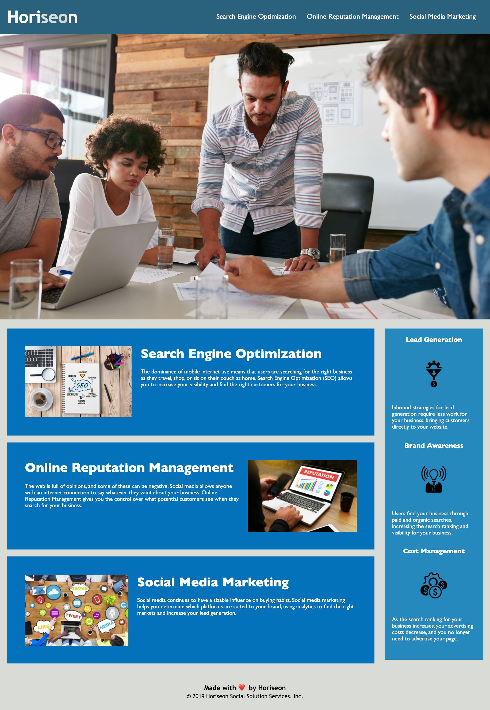

# horeiseon-refactor

By Charlotte Clark 

Technologies Used: 
* HTML
* CSS

I have been tasked with making this webpage for a marketing management company more accessible. 
* I replaced the non-semantic HTML elements with semantic HTML elements. 
* I added accessible alt attributes to image and icon elements.
* I established a more structured style for the organization and positioning of HTML elements.
* I added a concise, descriptive title element.
* I ensured the correct order for the heading attributes. 

